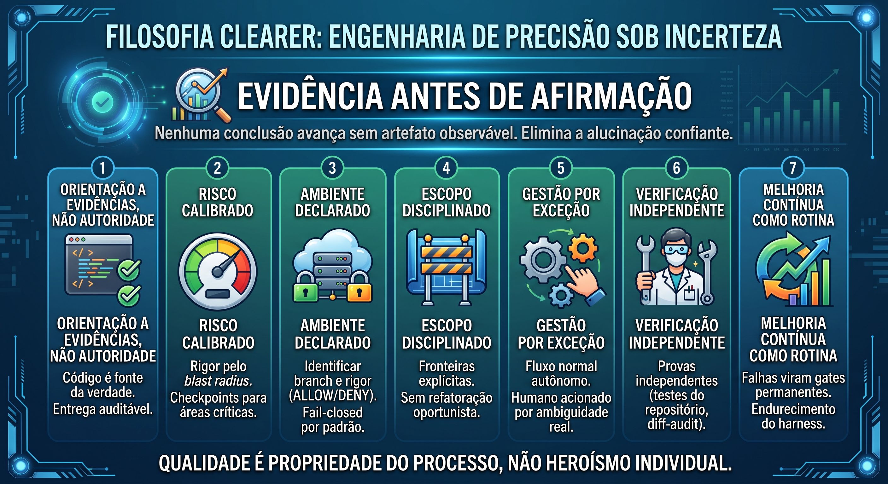

# muse-harness — CLEARER Engineering Harness for Muse Code

<p align="center">
  
</p>

<p align="center">
  <strong>Disciplina verificável sobre talento presumido.</strong><br>
  <em>Verified discipline over presumed talent.</em>
</p>

<p align="center">
  <a href="#-português-pt-br">Português (PT-BR)</a> ·
  <a href="#-english-en-us">English (EN-US)</a> ·
  <a href="docs/CREATE-PROFILE.md">Guide</a> ·
  <a href="HANDOFF.md">Handoff</a>
</p>

---

## 🇧🇷 Português (PT-BR)

Casa canônica dos **profiles harness do Muse Code**: metodologia de engenharia
empacotada como plugin nativo — protocolo CLEARER, rigor por ambiente, contrato
de resposta com evidências e economia de tokens — instalável em qualquer projeto.

> **Evidência antes de afirmação.** Nenhuma conclusão avança sem artefato
> observável. Qualidade é propriedade do processo, não heroísmo individual.

### Os 7 pilares (ver imagem acima)

| # | Pilar | Na prática |
|---|-------|------------|
| 1 | Orientação a evidências, não autoridade | Código é fonte da verdade; `OBSERVED / INFERRED / UNKNOWN` |
| 2 | Risco calibrado | Risk Dial `LOW / MEDIUM / HIGH`; checkpoints em áreas críticas |
| 3 | Ambiente declarado | Branch + `APP_ENV`/`CEH_ENV` + `.env*`; fail-closed (`ALLOW / ASK / DENY`) |
| 4 | Escopo disciplinado | Fronteiras explícitas; sem refatoração oportunista |
| 5 | Gestão por exceção | Fluxo autônomo; humano só ante ambiguidade real, `DENY` ou risco `HIGH` |
| 6 | Verificação independente | Testes do repo + `diff-audit` do próprio diff antes de entregar |
| 7 | Melhoria contínua como rotina | Falhas viram gates permanentes (ADRs, hooks, regressões) |

### O profile `clearer-muse` v0.5.0

| Capacidade | Estado |
|------------|--------|
| Dispatcher `clearer` (ciclo + Risk Dial + contrato) | ativo |
| Addon `token-economy` (tetos 8k/4k/2k/1k, compressão, higiene) | ativo |
| Addon `code-minimalism` (ordem nativo→mínimo, marcação `ponytail:`) | opt-in |
| Addon `debugging` (5 gates bloqueantes, relatório lesson-ready) | opt-in |
| Hook `safety-gate` (`PreToolUse`, veredito vinculante) | ativo |
| Trava Pre-Push CI Gate (tolerância zero + Certificado de Voo) | ativo |
| Runtime & CI Strategy Awareness (`RUNTIME_MODE` + `ci-cmd`) | ativo |
| Invariantes System One (7, em `clearer-review`/`clearer-audit`) | ativo |
| Heartbeat 25s p/ testes async (`scripts/heartbeat.sh`) | ativo |
| Endosso Context7 (fatos externos, provado fim-a-fim) | operacional |
| Segredos no repo | zero (só `${VAR}`, chave no host) |

### Estrutura

```text
profiles/clearer-muse/        # cópia canônica: skills, commands, hooks, scripts, manifest
  skills/{clearer,clearer-feature,clearer-refactor,clearer-review,clearer-test,
    clearer-audit,clearer-map,clearer-rules,clearer-adhd,token-economy,
    code-minimalism,debugging,learned-lesson}/
  commands/{clearer.md,token-report.md}  hooks/safety-gate.py
  scripts/{token-budget.py,compress-output.sh,canonical-diff.sh,
    detect-project.sh,test-runner.sh,diff-audit.sh,heartbeat.sh}
docs/CREATE-PROFILE.md        # guia: criar um profile harness do zero
templates/mcp.json            # base MCP (só `${VAR}`, sem segredos)
adr/001…005                   # decisões: Context7, lições, minimalismo, hook órfão, governança CEH
evals/                        # smoke-eval do safety-gate (15 asserts, CRITERIA.md pré-registrado)
img/CLEARER-MUSE.jpg          # filosofia em uma imagem
HANDOFF.md                    # estado verificado + ativação em 6 passos
```

### Rigor por ambiente

| Branch | Ambiente | Rigor |
|--------|----------|-------|
| `dev` | desenvolvimento | `ALLOW` (destrutivos p/ correção, com rollback) |
| `homologacao` | staging | `ASK` (blast radius + backup verificados) |
| `main` | produção | `DENY` (wipe, `reset --hard`, `push --force`, `rm -rf`…) |

Fluxo de promoção: `dev` → `homologacao` → `main`, sempre fast-forward, sem force.

### Início rápido

```bash
# 1. Sanidade
python3 -c "import json; json.load(open('profiles/clearer-muse/.muse-plugin/plugin.json'))"
# 2. Aponte a fonte instalada para profiles/clearer-muse e reinicie a sessão
muse plugins update clearer-muse   # após cada bump (exige restart: ADR-004)
# 3. Anti-deriva
profiles/clearer-muse/scripts/canonical-diff.sh [<destino>]
```

Detalhes: [guia](docs/CREATE-PROFILE.md) · [handoff](HANDOFF.md).

### Regras deste repo

- Nenhum segredo commitado (varredura `sk-*`/`Bearer` antes de cada push).
- PT-BR nos docs; commits `feat|fix|docs|…` (≤72 chars, sem `Co-Authored-By`).
- Toda afirmação técnica com fonte: arquivo, comando+saída ou teste.

---

## 🇺🇸 English (EN-US)

Canonical home of **Muse Code harness profiles**: engineering methodology
packaged as a native plugin — CLEARER protocol, per-environment rigor,
evidence-backed response contract, and token economy — installable in any project.

> **Evidence before assertion.** No conclusion advances without an observable
> artifact. Quality is a property of the process, not individual heroism.

### The 7 pillars (see image above)

| # | Pillar | In practice |
|---|--------|-------------|
| 1 | Evidence-driven, not authority-driven | Code is the source of truth; `OBSERVED / INFERRED / UNKNOWN` |
| 2 | Calibrated risk | `LOW / MEDIUM / HIGH` Risk Dial; checkpoints for critical areas |
| 3 | Declared environment | Branch + `APP_ENV`/`CEH_ENV` + `.env*`; fail-closed (`ALLOW / ASK / DENY`) |
| 4 | Disciplined scope | Explicit boundaries; no opportunistic refactoring |
| 5 | Management by exception | Autonomous flow; human paged only on real ambiguity, `DENY`, or `HIGH` risk |
| 6 | Independent verification | Repo tests + self `diff-audit` before delivery |
| 7 | Continuous improvement as routine | Failures become permanent gates (ADRs, hooks, regressions) |

### The `clearer-muse` profile v0.5.0

| Capability | Status |
|------------|--------|
| `clearer` dispatcher (cycle + Risk Dial + contract) | enabled |
| `token-economy` addon (8k/4k/2k/1k budgets, compression, hygiene) | enabled |
| `code-minimalism` addon (native→minimal order, `ponytail:` marks) | opt-in |
| `debugging` addon (5 blocking gates, lesson-ready report) | opt-in |
| `safety-gate` hook (`PreToolUse`, binding verdict) | enabled |
| Pre-Push CI Gate (zero tolerance + Flight Certificate) | enabled |
| Runtime & CI Strategy Awareness (`RUNTIME_MODE` + `ci-cmd`) | enabled |
| System One invariants (7, in `clearer-review`/`clearer-audit`) | enabled |
| 25s heartbeat for async tests (`scripts/heartbeat.sh`) | enabled |
| Context7 endorsement (external facts, proven end-to-end) | operational |
| Secrets in repo | zero (`${VAR}` only, key lives on host) |

### Layout

Same tree as above: `profiles/clearer-muse/` (canonical source), `docs/`,
`templates/mcp.json`, `adr/001–005`, `evals/`, `img/CLEARER-MUSE.jpg`, `HANDOFF.md`.

### Rigor per environment

| Branch | Environment | Rigor |
|--------|-------------|-------|
| `dev` | development | `ALLOW` (destructive ops for fixes, with rollback) |
| `homologacao` | staging | `ASK` (blast radius + verified backup) |
| `main` | production | `DENY` (wipes, `reset --hard`, `push --force`, `rm -rf`…) |

Promotion flow: `dev` → `homologacao` → `main`, always fast-forward, never force.

### Quickstart

```bash
# 1. Sanity
python3 -c "import json; json.load(open('profiles/clearer-muse/.muse-plugin/plugin.json'))"
# 2. Point the installed source at profiles/clearer-muse and restart the session
muse plugins update clearer-muse   # after each bump (restart required: ADR-004)
# 3. Anti-drift
profiles/clearer-muse/scripts/canonical-diff.sh [<target>]
```

Details: [guide](docs/CREATE-PROFILE.md) · [handoff](HANDOFF.md).

### Assumptions & gaps

- Assumes Muse Code loads plugins from the registered source at boot
  (observed via `installed.json`); `npx -y @upstash/context7-mcp` is taken as
  the official Context7 server distribution.
- Missing: official CLI command for local plugin (re)install (we observe state,
  not the installer); exact anonymous Context7 quota — assumed limited.

---

*PT-BR é o idioma canônico deste repo; a seção em inglês é tradução fiel.*
*PT-BR is this repo's canonical language; the English section is a faithful translation.*
